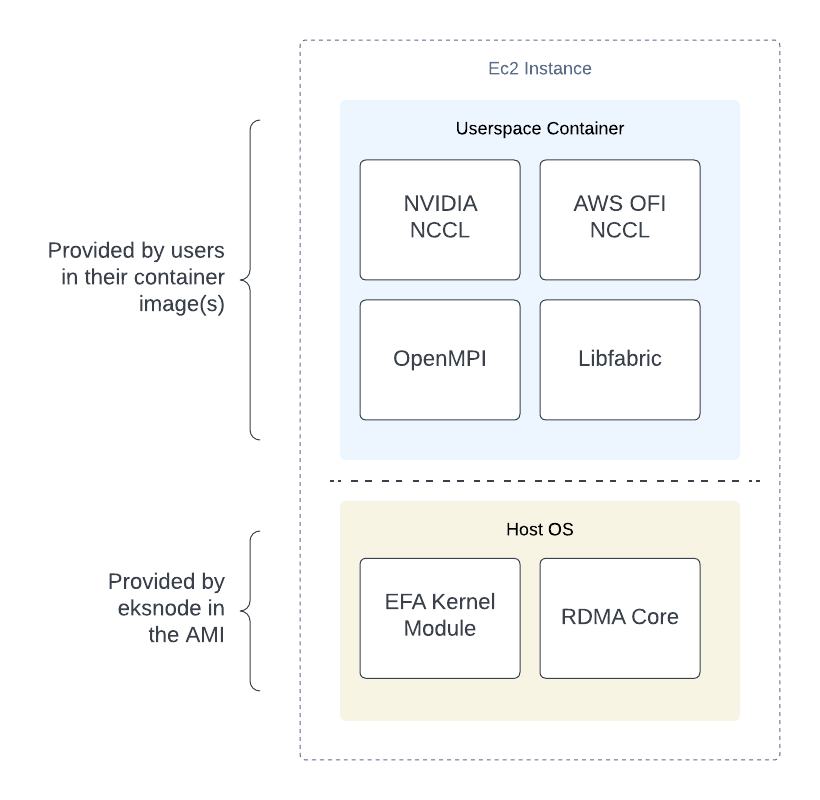
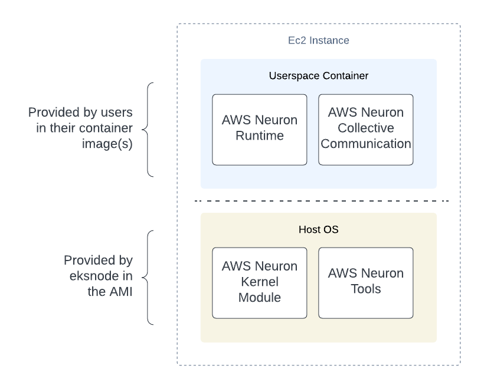
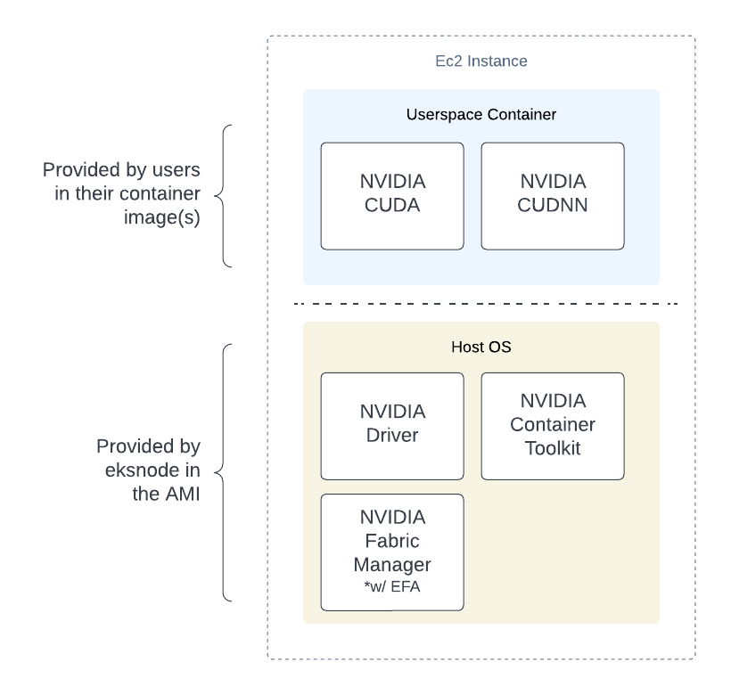

# Accelerated AMIs

Accelerated instances are primarily used in either high-performance computing (HPC) and/or machine learning (ML) workloads. `eksnode` supports enabling Elastic Fabric Adapter (EFA), AWS Neuron for AWS Tranium and Inferentia instance types, and NVIDIA GPUs.

On all accelerated AMIs created, deeper C-states are limited. See [High performance and low latency by limiting deeper C-states
](https://docs.aws.amazon.com/AWSEC2/latest/UserGuide/processor_state_control.html#c-states) for more information on C-states.

!!! note "Userspace container components"

    The userspace container components shown below are for reference only. Which respective components are required in the application containers is left up to users and their workload. This distinction is only provided to highlight which components that `eksnode` provides on the host (AMI), and the remaining components are expected to be installed in the application containers.

## Elastic Fabric Adapter (EFA)

When building an AMI for use with EFA, users can specify `enable_efa = true` to enable EFA support. This will install the EFA kernel module and RDMA Core on the host. The associated runtime(s) and collective communication libraries such as OpenMPI, libfabric, NVIDIA NCCL, and AWS OFI NCCL should be installed in the application containers that are deployed onto the instance.

```hcl
# Example *.pkrvars.hcl values
enable_efa = true
```

For more information on EFA, see the [AWS EFA documentation](https://docs.aws.amazon.com/AWSEC2/latest/UserGuide/efa.html).

<figure markdown>
  { width=80% }
  <figcaption>Elastic Fabric Adapter Components</figcaption>
</figure>

## AWS Neuron

When building an AMI for use with Tranium and/or Inferentia, users can specify `enable_neuron = true` to enable Neuron support. This will install the Neuron kernel module and Neuron tools on the host. The associated Neuron runtime and Neuron communication collective should be installed in the application containers that are deployed onto the instance.

```hcl
# Example *.pkrvars.hcl values
enable_neuron = true
enable_efa    = true # optional
```

For more information on Neuron, see the [AWS Neuron documentation](https://awsdocs-neuron.readthedocs-hosted.com/en/latest/).

<figure markdown>
  { width=80% }
  <figcaption>AWS Neuron Components</figcaption>
</figure>

## NVIDIA

When building an AMI for use with NVIDIA GPUs, users can specify `enable_nvidia = true` to enable NVIDIA support. This will install the NVIDIA driver and NVIDIA container toolkit on the host. When `enable_efa = true`, NVIDIA Fabric Manager will also be installed on the host. The associated NVIDIA runtime and communication collective libraries such as CUDA, CUDNN, and NCCL should be installed in the application containers that are deployed onto the instance.

```hcl
# Example *.pkrvars.hcl values
enable_nvidia = true
enable_efa    = true # optional
```

See the following for more information on the respective NVIDIA components:

- [NVIDIA Container Toolkit](https://docs.nvidia.com/datacenter/cloud-native/container-toolkit/latest/index.html)
- [NVIDIA CUDA Compatibility](https://docs.nvidia.com/deploy/cuda-compatibility/index.html)
- [NVIDIA Data Center Driver](https://docs.nvidia.com/datacenter/tesla/index.html)

<figure markdown>
  { width=80% }
  <figcaption>NVIDIA Components</figcaption>
</figure>
